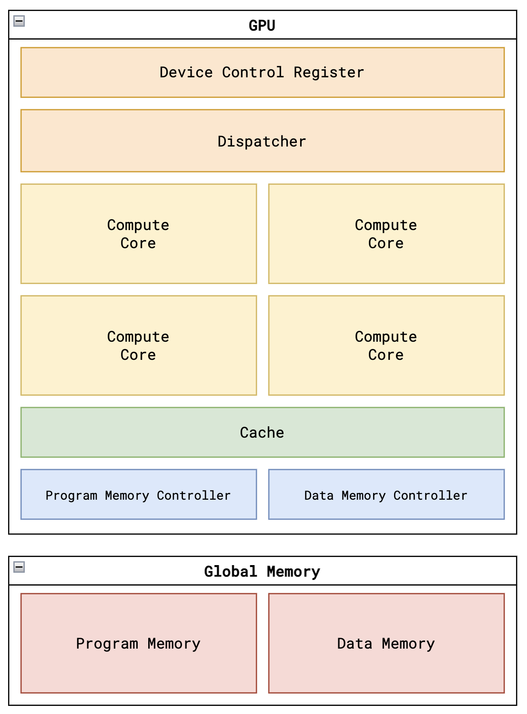
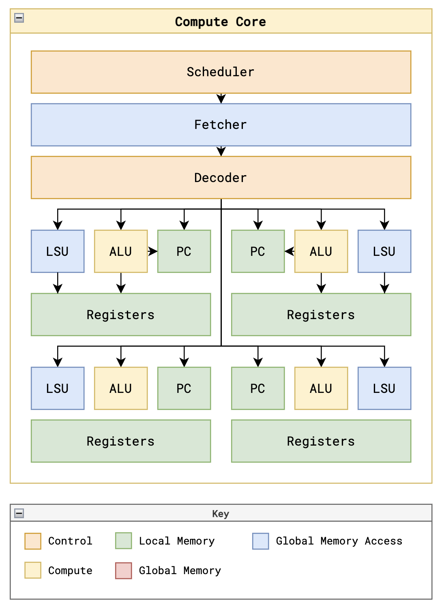
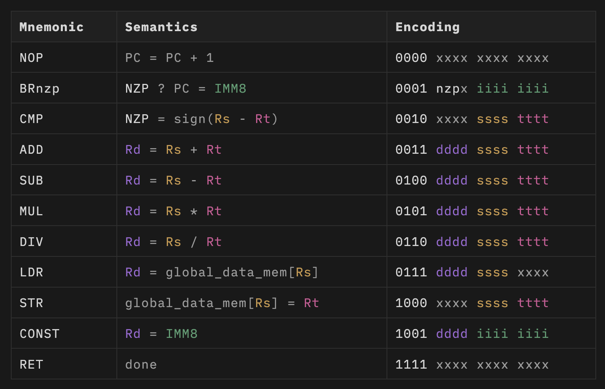
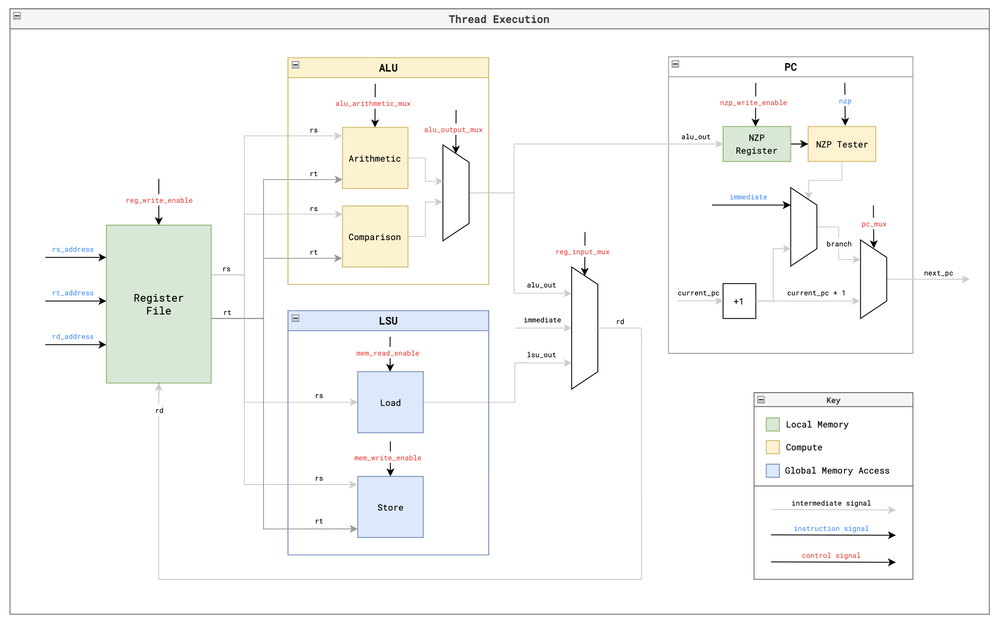
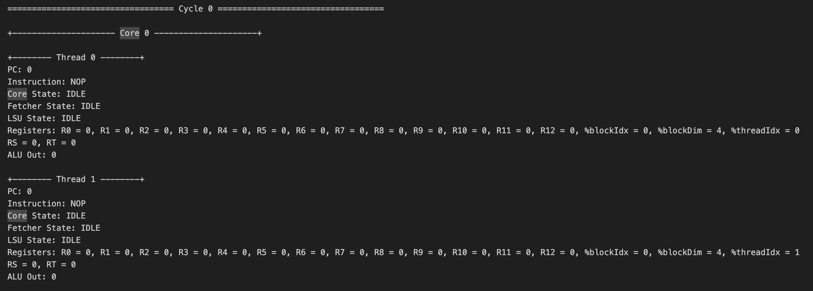

# IEEE Core Cascade: A Custom 8-Core SIMT GPU

This repository contains the SystemVerilog source code and physical implementation of a custom, minimal Single Instruction, Multiple Threads (SIMT) Graphics Processing Unit (GPU). Built as an upgrade to the open-source "Tiny-GPU" architecture, this project scales the system to an 8-core compute cluster capable of managing 32 parallel threads in flight to drive high-resolution hardware rendering on an FPGA.

## Project Overview

Modern GPUs are often proprietary and complex. This project demystifies the fundamental architecture of hardware accelerators by building a fully functional General-Purpose GPU (GPGPU) from scratch.

**Key Specifications:**
* **8-Core Compute Cluster**: Scaled from the original 2-core design to support massive parallelization.
* **32-Bit Q8.24 Fixed-Point ALU**: Upgraded arithmetic unit providing extreme precision for deep mathematical workloads like fractal rendering.
* **800x600 VGA Output**: An asynchronous dual-clock pipeline driving high-resolution video.
* **95 MHz Compute Clock**: Optimized via clock domain tuning to ensure hardware stability on the Artix-7 FPGA.

## Architecture

*Figure 1: Top-level block diagram integrating the GPU Cores, Dispatcher, and Dual-Port BRAM Framebuffer.*

The architecture is designed to decouple host communication from parallel execution engines:
* **Device Control Register (DCR)**: Expanded to 32 bits to store global thread metadata for up to 480,000 threads without integer overflow.
* **Dispatcher**: A finite state machine that breaks workloads into blocks of 4 threads and saturates all 8 cores with work until the frame is completed.
* **Physical Memory Separation**: Program and Configuration constants are stored in distributed LUTs, allowing the FPGA's physical Block RAM (BRAM) to be dedicated entirely as an asynchronous Framebuffer.

## Compute Core Components

*Figure 2: Datapath of a single Compute Core, highlighting the Fetcher, Decoder, and 4 independent Thread Register Files.*

Each core processes a single block of threads synchronously using a 7-stage pipeline (FETCH, DECODE, REQUEST, WAIT, EXECUTE, UPDATE, and DONE).
* **SIMT Support**: All 4 threads in a block receive the same control signals but operate on unique data based on read-only `%threadIdx` and `%blockIdx` registers.
* **Wait-State Scheduler**: The pipeline safely halts in a WAIT state until all memory requests to the global BRAM are reported as DONE, handling memory latency without data corruption.

## Custom ISA & Arithmetic

*Figure 3: The custom 16-bit ISA implemented in the GPU Decoder.*

The GPU operates on a custom 16-bit instruction format. A major architectural optimization was the removal of the hardware divider (DIV), which caused timing violations. Instead, the system uses **reciprocal multiplication**:
1. Pre-calculating the reciprocal of the screen width (e.g., 1/800).
2. Storing it as a Q8.24 constant in memory.
3. Executing a `FIXED_MUL` instruction to achieve division without slow hardware logic.

## Execution Model

*Figure 4: Thread-level execution path for computations on dedicated register files.*

The SIMT execution model assumes all threads converge to the same Program Counter after each instruction, simplifying the scheduler for mathematically dense algorithms like the Mandelbrot set.

## Benchmarking: Mandelbrot Set

The system was validated by rendering the Mandelbrot set at an 800x600 resolution. This requires dispatching 480,000 parallel threads across 120,000 discrete blocks.

*Figure 5: Simulation waveform demonstrating successful thread dispatching and memory dump.*

While the Vivado software simulator requires over 25 minutes to resolve a single frame, the custom silicon on the Nexys 4 DDR board renders the fractal almost instantly.

## Hardware Utilization (Artix-7 XC7A100T)

| Resource Type | Used | Available | Utilization |
| :--- | :--- | :--- | :--- |
| Look-Up Tables (LUTs) | 28,368 | 63,400 | 44.74% |
| Block RAM (36E1) | 128 | 135 | 94.81% |
| DSP Slices | 129 | 240 | 53.75% |

## Team

**National Institute of Technology Karnataka, Surathkal**
* **Team Members**: Rushil Jain, Shamit Hoysal, Vamshikrishna V Bidari, Vikram Singh
* **Project Mentors**: Mukul Paliwal, Ratan Y Mallya, Sirigiri Tarun

This project was built upon the "Tiny-GPU" open source repository.
